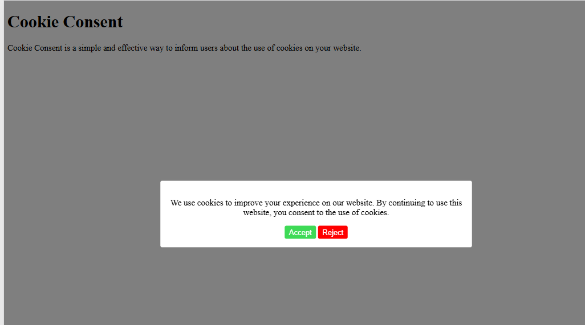

# Front-end Projects from Roadmap.sh

This repository contains front-end projects built following the [roadmap.sh](https://roadmap.sh/) front-end developer path.

## Projects List

[Single Page CV](https://roadmap.sh/projects/single-page-cv)
[Basic HTML Website](https://roadmap.sh/projects/basic-html-website)
[Personal Portfolio](https://roadmap.sh/projects/portfolio-website)
[ChangeLog Component](https://roadmap.sh/projects/changelog-component)
[Testimonials Cards](https://roadmap.sh/projects/testimonial-cards)
[Date-Picker UI](https://roadmap.sh/projects/datepicker-ui)
[Accessible Form UI](https://roadmap.sh/projects/accessible-form-ui)
[Image Grid](https://roadmap.sh/projects/image-grid)
[Tooltip UI](https://roadmap.sh/projects/tooltip-ui)
[Tabs](https://roadmap.sh/projects/simple-tabs)
[Cookie Consent](https://roadmap.sh/projects/cookie-consent)
[Restricted Textarea](https://roadmap.sh/projects/restricted-textarea)

Click any of the images below to view the readme and live demo of the project.

  

  

  
  

  
   

  
  

  
  

  
  

